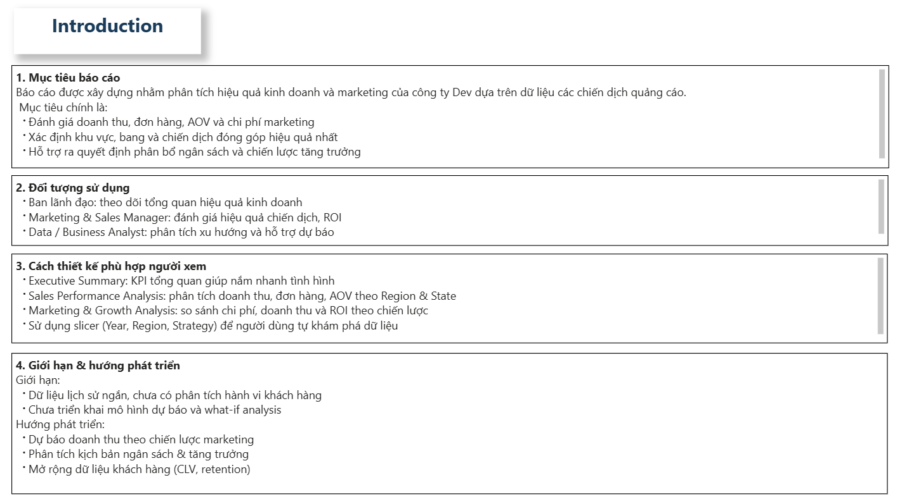
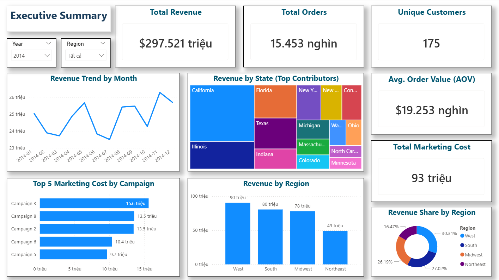
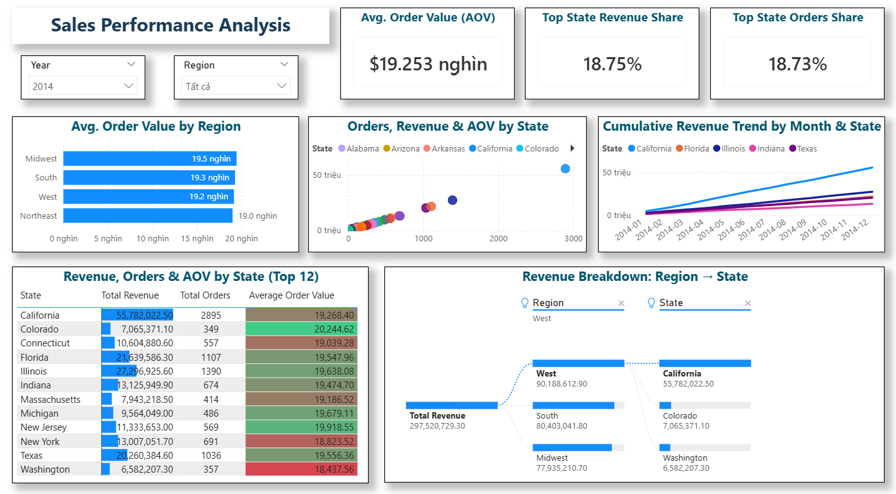
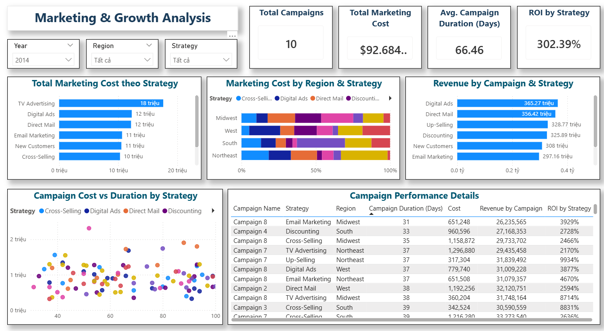

# Marketing Campaign Performance Dashboard

## Tổng quan
Dashboard phân tích hiệu quả các chiến dịch marketing và doanh thu bán hàng của công ty kinh doanh đồ thể thao nhằm hỗ trợ quyết định phân bổ ngân sách marketing.

## Công cụ
- Power BI
- Excel

## Kết quả chính

- **Tổng doanh thu 2014:** ~$297.5M  
- **Số đơn hàng:** 15.4K  
- **AOV:** ~$19.25K  

### Insight quan trọng
- **West** là khu vực đóng góp doanh thu lớn nhất (~30%).  
- **California** dẫn đầu với ~19% tổng doanh thu.  
- Doanh thu **tăng mạnh vào cuối năm** → yếu tố mùa vụ rõ rệt.  
- **Digital Ads** và **Direct Mail** tạo doanh thu cao nhất.  
- **Email Marketing** và **Up-Selling** có ROI rất cao với chi phí thấp.  
- **TV Advertising** tốn chi phí cao nhưng doanh thu thấp.

## Khuyến nghị
- Tăng ngân sách marketing vào **giai đoạn cao điểm cuối năm**.  
- Mở rộng chiến dịch tại **khu vực có doanh thu cao**.  
- Tối ưu **Email Marketing và Up-Selling**.  
- Đánh giá lại hiệu quả **TV Advertising**.

## Dashboard Preview

