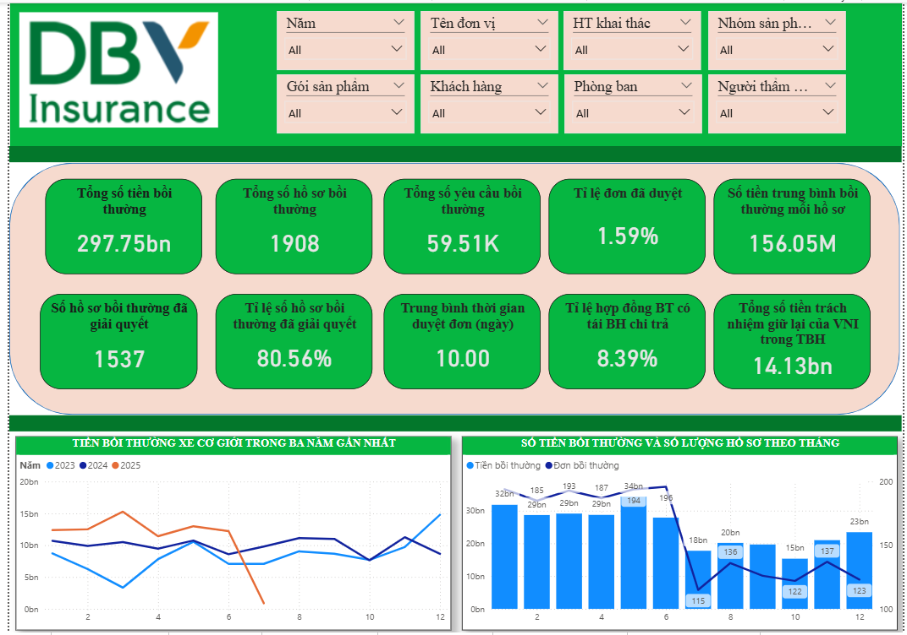
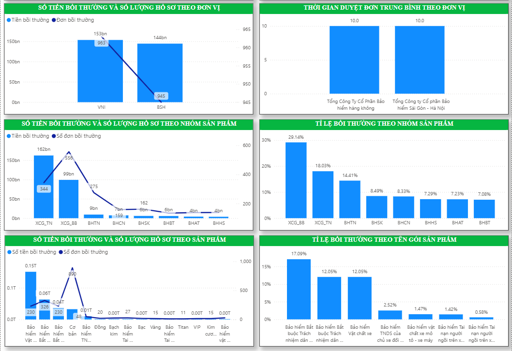
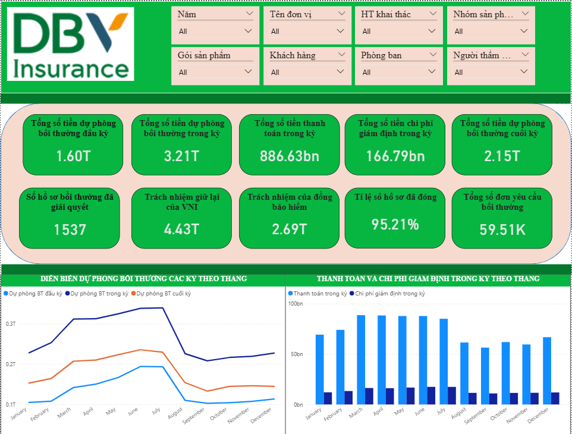
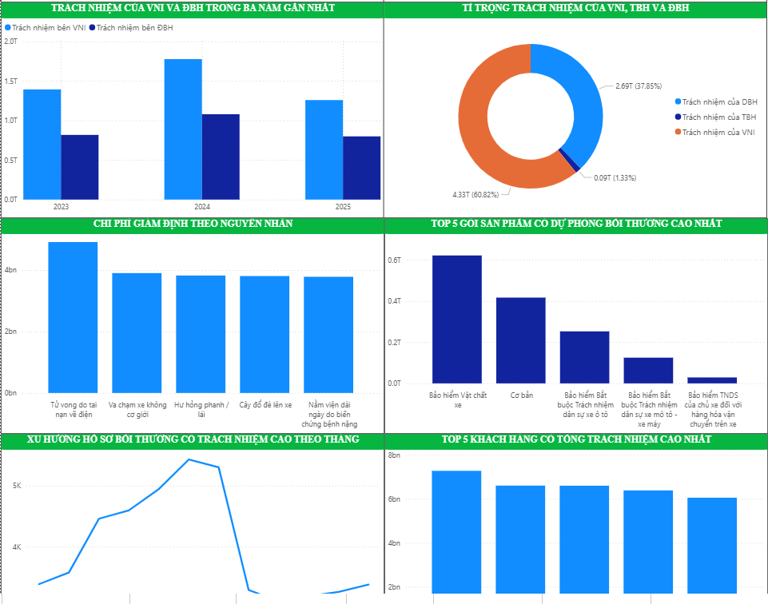
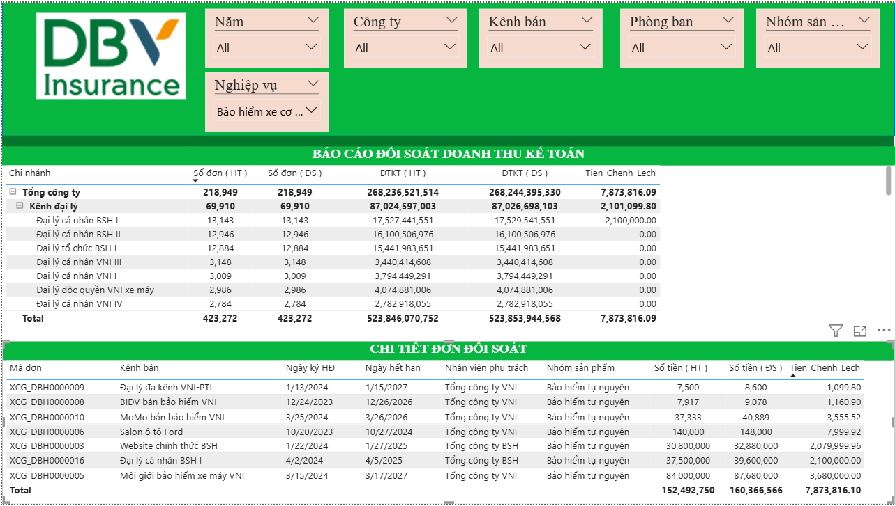

# 📊 Insurance Analytics Project

## 📝 Giới thiệu
Dự án này mô phỏng một hệ thống phân tích dữ liệu trong lĩnh vực **bảo hiểm xe cơ giới**, bao gồm thiết kế mô hình dữ liệu (Star Schema), xây dựng bảng dữ liệu (Fact & Dimension), sinh dữ liệu mẫu, viết truy vấn SQL để phân tích, và trực quan hóa kết quả qua Power BI.

Mục tiêu của dự án:
- Xây dựng cơ sở dữ liệu phân tích cho các hoạt động bảo hiểm.
- Tạo dữ liệu mẫu có cấu trúc thực tế.
- Viết các truy vấn SQL trả lời những câu hỏi nghiệp vụ phổ biến.
- Thiết kế dashboard trực quan hỗ trợ ra quyết định.

---

## 🧠 Kỹ năng áp dụng
- **SQL**: Thiết kế bảng, viết truy vấn phân tích, tổng hợp dữ liệu.  
- **Data Modeling**: Xây dựng mô hình dữ liệu theo dạng Star Schema.  
- **Data Generation**: Tạo dữ liệu giả lập bằng Python.  
- **Data Visualization**: Thiết kế báo cáo tương tác bằng Power BI.  

## 📂 Tải tài liệu & dữ liệu

- 📑 [Data Dictionary (Google Docs)](https://docs.google.com/spreadsheets/d/18_tjiJxNv2Y84GqxbYNa-oJivV-1WsrBNAXT4BZi0Mc/edit?usp=sharing)
- 📊 [Dữ liệu mẫu (GG drive)](https://docs.google.com/spreadsheets/d/1bPzSEV51qFgN6S6sJJpqZS4MuKGjW8m8/edit?usp=sharing&ouid=115040697668877238562&rtpof=true&sd=true) ( Dữ liệu này khá lớn )
- 📈 [Dashboard Power BI]

### 1️⃣ Tổng quan bồi thường

### 2️⃣ Tổng quan dự phòng bồi thường

### 3️⃣ Phân tích đối soát kế toán

